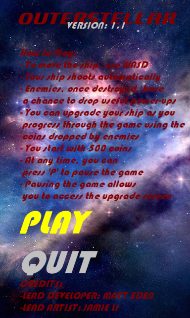
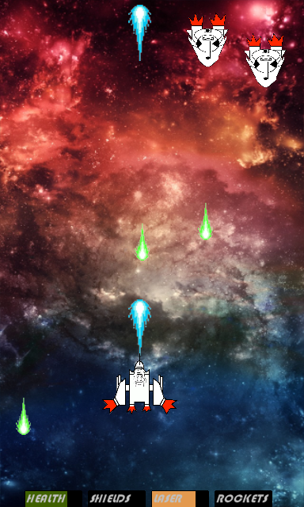
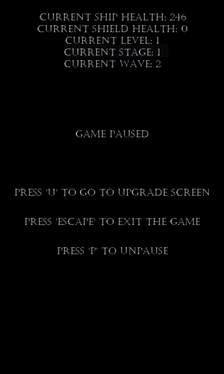
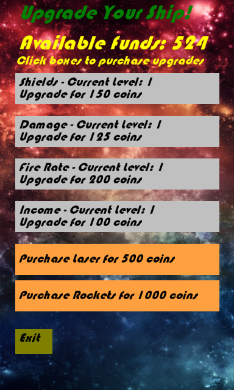

# Outerstellar
A top-down arcade space shooter made in Gamemaker over 5 days as part of an Arcade Games Hackathon in July 2016.

## Features
* Upgrade System
* 3 Level types
* 4 Enemy types
* Powerups

## Install
Simply run the executable `OuterstellarV1_1Install.exe`.

## Screenshots

## Copyright
All rights belong to their respective owners. This software is provided ‘as-is’. Not all assets used are mine.
Copyright [2016-2020] [Matthew James Eden]
